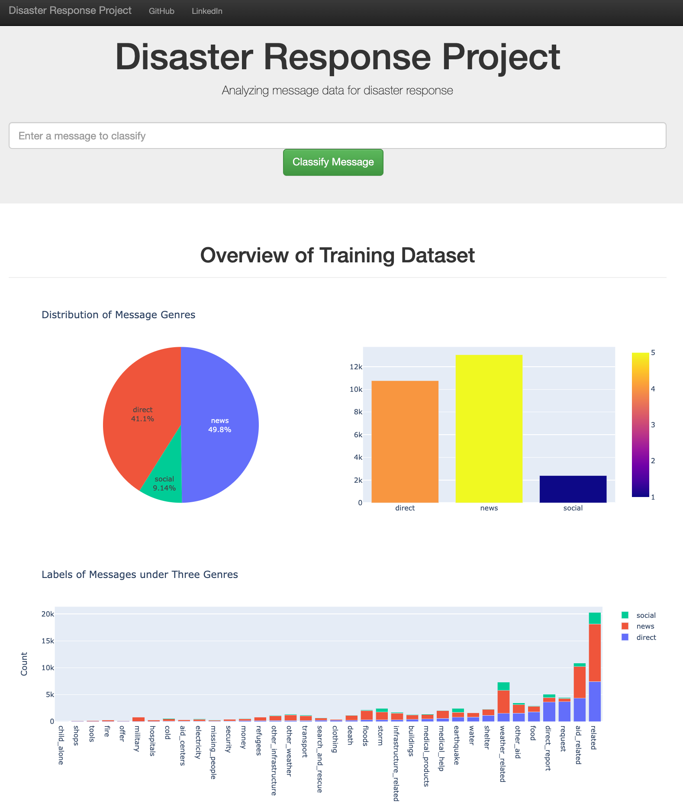

# Disaster Response System

### Introduction

In this project, I have built a machine learning system using Python to analyze disaster data from [Figure Eight](https://www.figure-eight.com/) and deploy the system to web server using flask to classify and visualize disaster messages.  

### Dataset 

`messages.csv` : 26,000+ disaster messages 

`categories.csv`: 26,000+ categories dataset

e.g., earthquake, flood, medical help, refugees 

### Procedure 

1. Created **ETL pipeline** to preprocess the text data
   + Loads the `messages` and `categories` datasets
   + Merges the two datasets
   + Cleans the data 
   + Stores it in a SQLite database 
  +  pandas.tosql() SQLAlichemy library
   
2. Built **ML pipeline**
   - Loads data from the SQLite database
   
   - Splits the dataset into training and test sets
   
   - Builds a text processing and machine learning pipeline
   
  - tokenize text and countVectorize tokens and create tfidf modle 
     - Note: multiOputputClassifier
   
   - Trains and tunes a model using GridSearchCV
   
   - Outputs results on the test set
   
     
   
   - Exports the final model as a pickle file
   
3. create web app using Flask 
   
   + data visualizations using Plotly in the web app

### Demo Display

